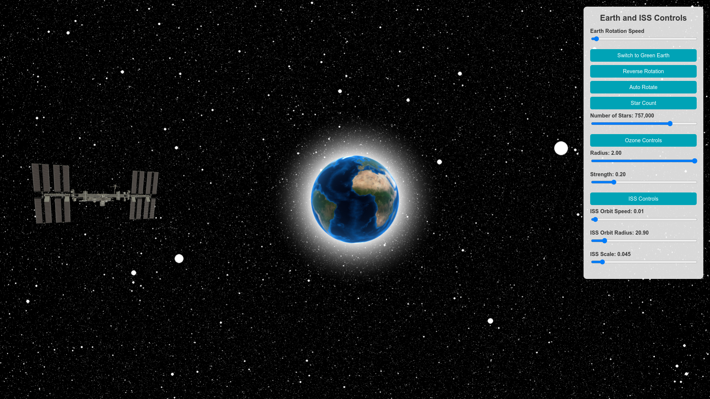

# Earth Visualization with ISS Orbit

This project is a 3D interactive visualization of Earth and the International Space Station (ISS) orbit, built using [three.js](https://threejs.org/). The application allows users to manipulate the Earth's rotation, the star count, the ozone layer properties, and the ISS orbit parameters in real-time. The project demonstrates the use of WebGL and custom shaders to simulate realistic effects like Earth’s atmosphere, ozone layer, and stars.

## Features

- **Interactive Earth Model**: Control Earth's rotation speed and direction.
- **Realistic Atmosphere and Ozone Layer**: Simulate Earth’s atmosphere and ozone layer using custom shaders with adjustable properties.
- **Dynamic Star Background**: Adjust the number of stars rendered in the background.
- **ISS Orbit**: Visualize the International Space Station orbiting Earth, with real-time controls for orbit speed, radius, and scale.
- **User Interface**: An intuitive control panel for modifying the settings.

## Screenshots


*Figure 1: Start screen showing Earth with atmosphere and star background.*


*Figure 2: ISS orbiting Earth with control panel displayed.*

## Installation and Setup

### Prerequisites

- **Node.js**: [Download and install Node.js](https://nodejs.org/en/) (v14 or higher recommended).
- **Web Browser**: Modern browser with WebGL support (e.g., Google Chrome, Mozilla Firefox, Microsoft Edge).

### Steps

1. **Clone the repository**:
    

2. **Installation**:
    
    npm install

3. **Run!!**:
    
    npm run dev    

### Run locally
    git clone https://github.com/Sabbbir/Earth.git
    cd Earth
### Run locally
    npm i
    npm install
    npx vite
 

## Access the application:

Once the server is running, navigate to the provided URL in your web browser to interact with the Earth Visualization app.

## Project Directory Structure

Here is the structure of the project showing the key files and directories:

```bash
.
├── index.html                  # Main HTML file
├── src/                        # Source directory for project files
│   ├── main.js                 # Core JavaScript file for three.js setup
│   ├── shaders/                # Directory for shaders
│   │   ├── vertex.glsl         # Vertex shader for Earth
│   │   ├── fragment.glsl       # Fragment shader for Earth
│   │   ├── atmosphereVertex.glsl  # Vertex shader for atmosphere
│   │   ├── atmosphereFragment.glsl # Fragment shader for atmosphere
│   │   ├── ozoneVertex.glsl    # Vertex shader for ozone layer
│   │   └── ozoneFragment.glsl  # Fragment shader for ozone layer
│   └── assets/                 # Assets directory
│       ├── earth.jpg           # Texture for Earth surface
│       └── satellites/         # Directory for 3D satellite models
│           └── ISS_stationary.glb  # 3D model of the ISS
├── package.json                # Project dependencies and scripts
├── package-lock.json           # Lockfile for npm dependencies
├── README.md                   # Project documentation
└── .gitignore                  # Git ignore file to exclude unnecessary files
```
## Usage

Once the application is running, you can interact with the following features from the control panel:

### Earth Rotation:
- **Rotation Speed Slider**: Adjust the rotation speed of Earth.
- **Reverse Rotation Button**: Toggle the rotation direction of Earth.
- **Auto Rotate Button**: Automatically rotate the camera around Earth.

### Star Count:
- **Star Count Slider**: Modify the number of stars displayed in the background.

### Ozone Layer:
- **Radius Slider**: Control the size of Earth's ozone layer.
- **Strength Slider**: Adjust the intensity of the ozone layer's glow.

### ISS Orbit:
- **Orbit Speed Slider**: Adjust the speed at which the ISS orbits Earth.
- **Orbit Radius Slider**: Change the distance of the ISS from Earth.
- **Scale Slider**: Modify the size of the ISS model.
