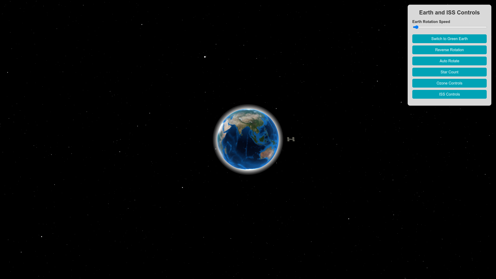

# Earth Visualization with ISS Orbit

This project is a 3D interactive visualization of Earth and the International Space Station (ISS) orbit, built using [three.js](https://threejs.org/). The application allows users to manipulate the Earth's rotation, the star count, the ozone layer properties, and the ISS orbit parameters in real-time. The project demonstrates the use of WebGL and custom shaders to simulate realistic effects like Earth’s atmosphere, ozone layer, and stars.

## Features

- **Interactive Earth Model**: Control Earth's rotation speed and direction.
- **Realistic Atmosphere and Ozone Layer**: Simulate Earth’s atmosphere and ozone layer using custom shaders with adjustable properties.
- **Dynamic Star Background**: Adjust the number of stars rendered in the background.
- **ISS Orbit**: Visualize the International Space Station orbiting Earth, with real-time controls for orbit speed, radius, and scale.
- **User Interface**: An intuitive control panel for modifying the settings.

## Screenshots


*Figure 1: Start screen showing Earth with atmosphere and star background.*


*Figure 2: ISS orbiting Earth with control panel displayed.*

## Installation and Setup

### Prerequisites

- **Node.js**: [Download and install Node.js](https://nodejs.org/en/) (v14 or higher recommended).
- **Web Browser**: Modern browser with WebGL support (e.g., Google Chrome, Mozilla Firefox, Microsoft Edge).

### Steps

1. **Clone the repository**:

   ```bash
   git clone https://github.com/Sabbbir/Earth.git
   cd Earth
    npm install
    npm run dev
    
Access the application:

Once the server is running, navigate to the provided URL in your web browser to interact with the Earth Visualization app.
